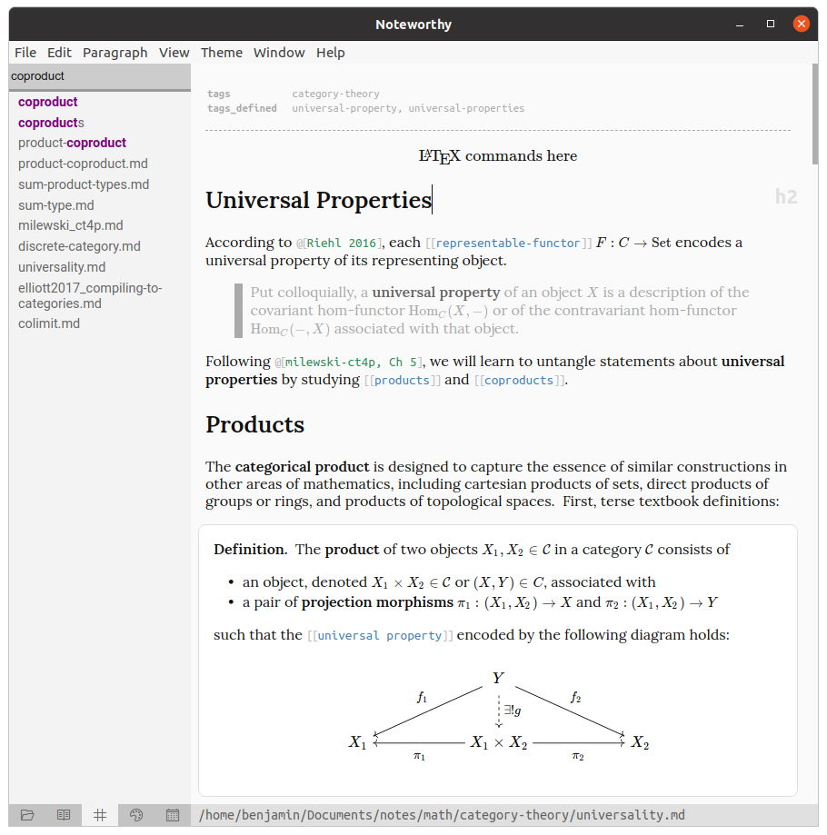
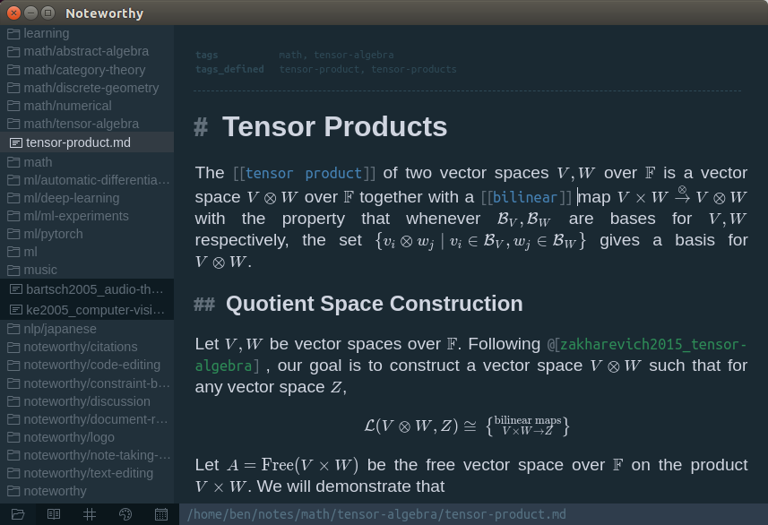
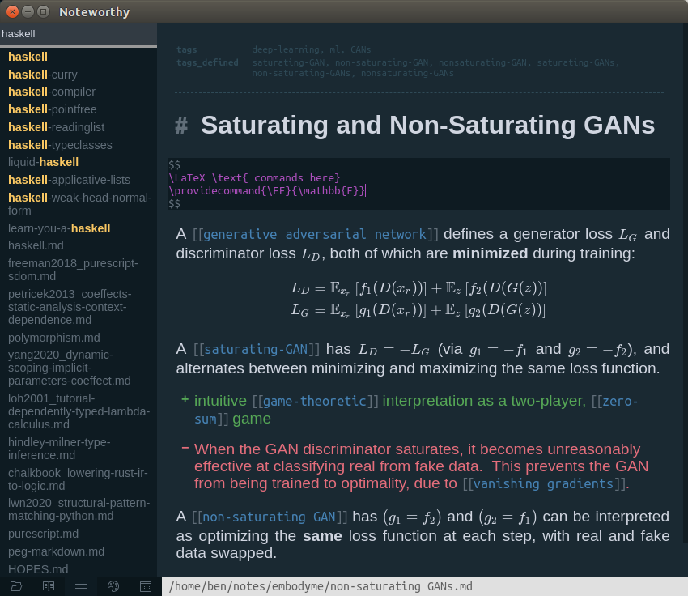
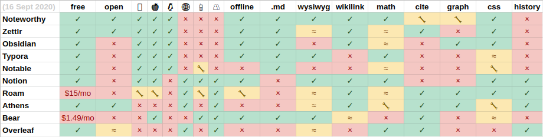

> Noteworthy is currently in development!  I work on Noteworthy in my free time, so progress comes in bursts.


# Noteworthy ([https://noteworthy.ink/](https://noteworthy.ink/))

A free, open-source, local-first Markdown editor built with [ProseMirror](https://prosemirror.net/).

* Works directly with your **local** files, entirely **offline**.
* Write your notes in **Markdown**, with **syntax extensions** like citations and block directives. 
* Build your own personal wiki with **bidirectional links**.
* Excellent **math** support — seamlessly transition between source and rendered math, thanks to [KaTeX](https://katex.org/) and [prosemirror-math](https://github.com/benrbray/prosemirror-math).

## Features

completed syntax features

- [x] headings, blockquotes, lists
- [x] bold, italic
- [x] inline and block code
- [x] inline and block math via [`prosemirror-math`](https://github.com/benrbray/prosemirror-math)
- [x] YAML metadata
- [x] blob-embedded images
- [x] `[[wikilink]]` syntax
- [x] citation syntax, in both `@[noteworthy]`-style and `[@pandoc]`-style
- [x] support for named environments (such as theorems, definitions, proofs) via [directive](https://github.com/remarkjs/remark-directive) syntax

completed editor features

- [x] fuzzy tag search
- [x] outline view
- [x] custom CSS with live reload
- [x] fail gracefully on unsupported markdown syntax extensions
- [x] support `\providecommand` in math nodes

in-progress

- [ ] ([WIP](https://github.com/benrbray/noteworthy/pull/36)) code block syntax highlighting via [`codemirror`](https://codemirror.net/)
- [ ] ([WIP](https://github.com/benrbray/noteworthy/pull/36)) support for `tikz` diagrams via [`@drgrice1/tikzjax`](https://github.com/drgrice1/tikzjax/tree/ww-modifications)

planned

- [ ] import `bibtex` or `csl-json` bibliography file
- [ ] populate note from bibliography entry
- [ ] community plugin system
- [ ] filesystem-local images
- (...and more!)

### Excellent Math Support

Inline Math:


Display Math:


## Screenshot

> (screenshot taken 12 July 2021)




> (screenshot taken 16 September 2020)



> (screenshot taken 17 September 2020)



## Feature Comparison

### Obsidian

[Obsidian](https://obsidian.md/) (especially its community plugins) has been a source of inspiration for me during the development of Noteworthy, and occupies a similar position in the note-taking space, but with a few key differences:

* Noteworthy aims to be **fully open source**, so that the editor is fully customizable beyond what is possible with community plugins alone.  By contrast, the kernel of Obsidian is closed-source, making it more difficult for empassioned users to add the features they need.
* Noteworthy is WYSIWYG-first (based on [ProseMirror](https://prosemirror.net/)), while Obsidian began as a split-pane editor and only introduced WYSIWYG-mode later (based on [CodeMirror](https://codemirror.net/)).
* Taking inspiration from [Zettlr](https://www.zettlr.com/), Noteworthy aims to provide first-class support for **bibliography** management and academic citations.
* Noteworthy aims to provide a smooth, polished experience for math-heavy and diagram-heavy notetaking.
* Noteworthy will allow the user to mix-and-match different Markdown syntax extensions per-file via `flavor` metadata, to maximize **interoperability** with other editors.

### Other Editors

The table below compares Noteworthy to other editors with similar features.  Of course, each editor has its own unique features not listed!  For an even more detailed comparison, check out the [exhaustive feature comparison](https://www.notion.so/db13644f08144495ad9877f217a161a1?v=ff6777802811416ba08dc114e0b11837) put together by the folks at [Athens Research](https://github.com/athensresearch/athens).



> Last updated 16 September 2020.  If you notice any errors or omissions in the feature comparison table, please [file an issue](https://github.com/benrbray/noteworthy/issues/new/choose) and I will correct it.

## Building Noteworthy

> Noteworthy is NOT quite ready for use.  However, you can follow these instructions if you really wish to run it.

```
git clone --recurse-submodules git@github.com:benrbray/noteworthy.git
cd noteworthy
npm install
npm run dist
```

After building, look in the `/dist` folder for an executable.

## Acknowledgements

* Thanks to [Marijn Haverbeke](https://marijnhaverbeke.nl/) for developing [ProseMirror](https://prosemirror.net/)!
* Thanks to [Hendrik Erz](https://github.com/nathanlesage) for keeping [Zettlr](https://github.com/Zettlr/Zettlr) open source!  When I started developing Noteworthy, I had no clue how to set up an Electron app or responsibly interact with the user's file system from Node, and the Zettlr source was a great reference.
* Thanks to Microsoft for keeping [VS Code](https://github.com/Microsoft/vscode) open source!  I learned a lot by reading the source of the VS Code tree viewer and plugin system.
* Thanks to [Fabio Spampinato](https://fabiospampinato.com/) for releasing the source to an early version [Notable](https://github.com/notable/notable)!